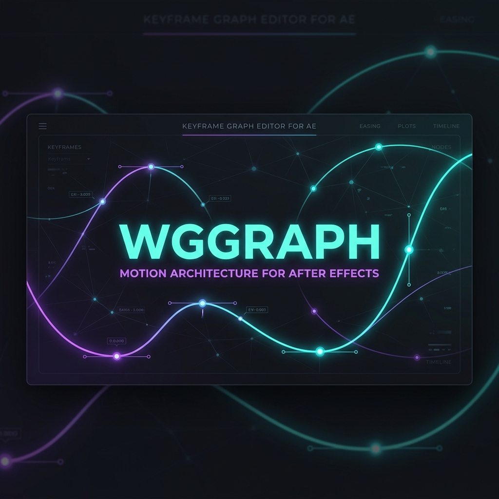
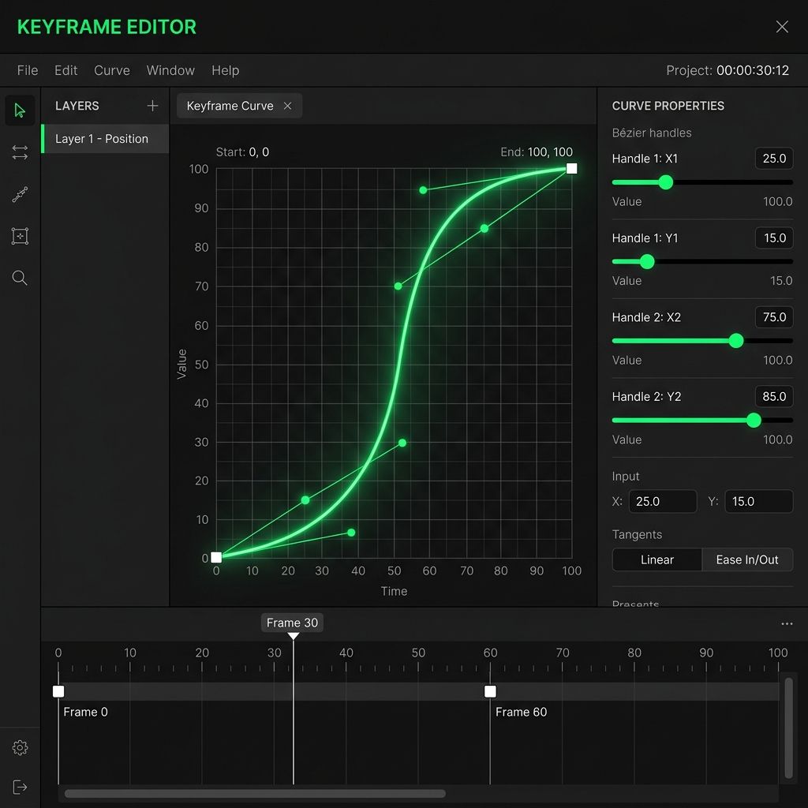
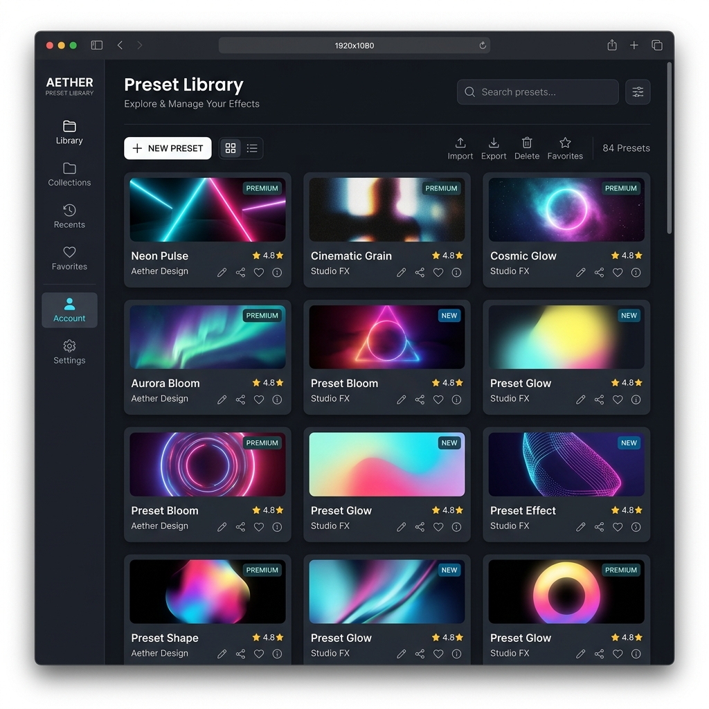

# WGGraph



**WGGraph** is an advanced, professional-grade keyframe interpolation and motion architecture panel for Adobe After Effects. It streamlines complex animation workflows by providing a visual, intuitive interface for curve manipulation, preset management, and keyframe easing engines.

---

## Features

### 1. Advanced Easing Engines
Multiple interpolation systems to control the dynamics of your keyframes:
* **Bézier:** Precision control point tuning (X1, Y1, X2, Y2) in Value and Speed graph views.
* **Elastic:** Natural spring-back easing with customizable frequency and decay.
* **Bounce:** Physics-based bouncing simulation with configurable gravity and rebound.
* **Steps / Wave / Custom:** Specialized curves for stepped animations and wave patterns.



### 2. Custom Preset Manager & Library
A robust, persistent catalog of your custom curves:
* **Import & Export:** Export your presets as JSON arrays or import presets from backup or other creators.
* **Delete & Search:** Instantly locate and organize your presets.
* **Instant Application:** Double-click or click to inject easing curves directly onto your selected After Effects layers.



### 3. Integrated Native Auto-Updater
An automated, silent updater that works 100% inside the panel:
* **Zero Browser Overhead:** Downloads directly using Node.js without opening Brave, Chrome, or external browsers.
* **Real-time Progress Indicator:** Shows download percentage, download speed in **Mbps**, and current size.
* **Safe Verification & Install:** Automatically extracts packages, overwrites plugin files, cleans temporary directories, and restarts the panel with a 5-second countdown.

---

## Installation

1. Download the latest compiled extension release (e.g., `WGGraph_v2.0.41.zxp` or `WGGraph_v2.0.5.0.zxp`).
2. Install it using a ZXP Installer of your choice (such as ZXP Installer by Aescripts, Anastasiy's Utility, or ZXP Installer).
3. In Adobe After Effects, ensure you have enabled:
   * **Preferences > Scripting & Expressions > Allow Scripts to Write Files and Access Network**.
4. Open the extension from **Window > Extensions > WGGraph**.

---

## Development & Building

If you are modifying the source code and want to compile the production bundle and package it into a ZXP extension, run the build script:

```powershell
python build_and_package.py
```

This script will:
1. Merge the modular scripts inside `src/` into `dist/bundle.js`.
2. Package the directory structure into a production-ready `.zxp` file under the root workspace folder.

---

## License

This project is licensed under the MIT License - see the [LICENSE](LICENSE) file for details.